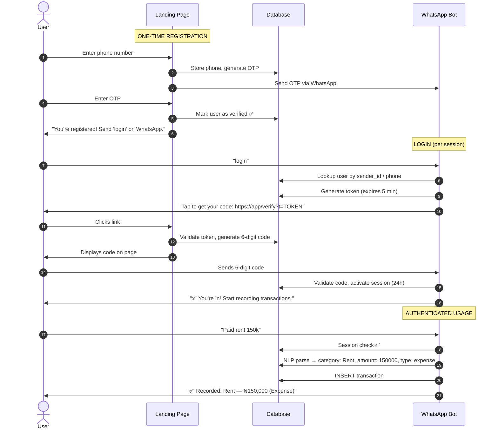
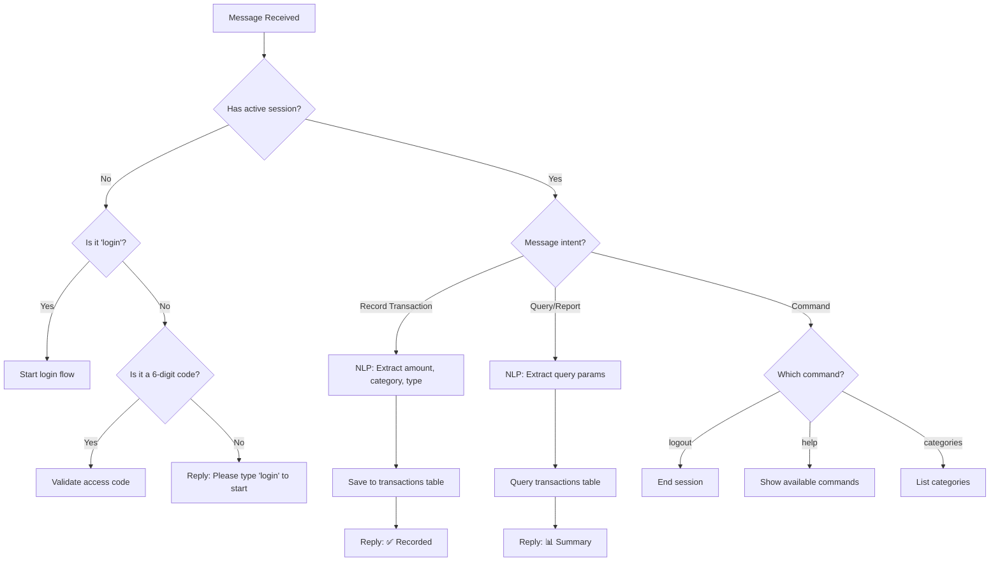

# Comprehensive Proposal: WhatsApp Bookkeeper — Auth & User Management

> **The Vision**: A full bookkeeping system powered by natural language, accessed entirely through WhatsApp.  
> Users say things like *"I bought fuel 2k"* or *"How much did I spend on food this week?"* and the system understands, records, and reports.

---

## 1. Understanding the Application

### What Users Do (All via WhatsApp Chat)

| Action | Example Message | Bot Response |
|---|---|---|
| Record expense | *"Bought fuel 2k"* | ✅ Recorded: Fuel — ₦2,000 (Expense) |
| Record income | *"Client paid me 50k"* | ✅ Recorded: Client payment — ₦50,000 (Income) |
| Query spending | *"How much did I spend on fuel this month?"* | 📊 Fuel this month: ₦12,500 across 4 transactions |
| Query balance | *"What's my balance?"* | 💰 Income: ₦150,000 · Expenses: ₦87,000 · Net: ₦63,000 |
| Query by period | *"Show my expenses last week"* | 📋 List of categorized expenses |
| Login | *"login"* | 🔗 Click this link to get your access code |
| Logout | *"logout"* | 👋 Session ended |

### What the Web Layer Does (Minimal — 2 pages only)

1. **Landing/Registration Page** — Enter phone number, verify via OTP
2. **Code Display Page** — Show a 6-digit access code after clicking the WhatsApp login link

No dashboard. No web-based reporting. Everything happens in the chat.

---

## 2. Authentication Flow



---

## 3. Database Schema

The schema is designed to support multi-user bookkeeping with categorized transactions, authentication, and querying.

```sql
-- ============================================
-- USERS & AUTHENTICATION
-- ============================================

-- Core user accounts
CREATE TABLE users (
    id INT AUTO_INCREMENT PRIMARY KEY,
    phone_number VARCHAR(20) UNIQUE NOT NULL,
    display_name VARCHAR(100) NULL,
    is_verified BOOLEAN DEFAULT FALSE,
    created_at TIMESTAMP DEFAULT CURRENT_TIMESTAMP
);

-- Links WhatsApp sender IDs to user accounts
-- (a user may have multiple sender_ids if they use WhatsApp on different devices)
CREATE TABLE whatsapp_accounts (
    sender_id VARCHAR(50) PRIMARY KEY,
    user_id INT NOT NULL,
    linked_at TIMESTAMP DEFAULT CURRENT_TIMESTAMP,
    FOREIGN KEY (user_id) REFERENCES users(id) ON DELETE CASCADE
);

-- OTPs and access codes (used for both registration and login)
CREATE TABLE verification_codes (
    id INT AUTO_INCREMENT PRIMARY KEY,
    phone_number VARCHAR(20) NOT NULL,
    code VARCHAR(6) NOT NULL,
    token VARCHAR(100) UNIQUE NULL,
    purpose ENUM('registration', 'login') NOT NULL,
    expires_at TIMESTAMP NOT NULL,
    used BOOLEAN DEFAULT FALSE,
    created_at TIMESTAMP DEFAULT CURRENT_TIMESTAMP,
    INDEX idx_phone_purpose (phone_number, purpose),
    INDEX idx_token (token)
);

-- Active chat sessions (controls who can interact with the bot)
CREATE TABLE sessions (
    id INT AUTO_INCREMENT PRIMARY KEY,
    sender_id VARCHAR(50) NOT NULL,
    user_id INT NOT NULL,
    expires_at TIMESTAMP NOT NULL,
    is_active BOOLEAN DEFAULT TRUE,
    created_at TIMESTAMP DEFAULT CURRENT_TIMESTAMP,
    INDEX idx_sender_active (sender_id, is_active),
    FOREIGN KEY (user_id) REFERENCES users(id) ON DELETE CASCADE
);

-- ============================================
-- BOOKKEEPING
-- ============================================

-- Transaction categories (system-defined + user-defined)
CREATE TABLE categories (
    id INT AUTO_INCREMENT PRIMARY KEY,
    user_id INT NULL,           -- NULL = system default, otherwise user-custom
    name VARCHAR(100) NOT NULL,
    type ENUM('income', 'expense', 'both') NOT NULL DEFAULT 'both',
    FOREIGN KEY (user_id) REFERENCES users(id) ON DELETE CASCADE
);

-- All financial transactions
CREATE TABLE transactions (
    id INT AUTO_INCREMENT PRIMARY KEY,
    user_id INT NOT NULL,
    category_id INT NULL,
    type ENUM('income', 'expense') NOT NULL,
    amount DECIMAL(15, 2) NOT NULL,
    description VARCHAR(255) NULL,      -- NLP-extracted description
    raw_text VARCHAR(500) NOT NULL,     -- Original message from user
    transaction_date DATE NOT NULL,     -- Defaults to today, but NLP can extract "yesterday" etc.
    created_at TIMESTAMP DEFAULT CURRENT_TIMESTAMP,
    FOREIGN KEY (user_id) REFERENCES users(id) ON DELETE CASCADE,
    FOREIGN KEY (category_id) REFERENCES categories(id) ON DELETE SET NULL,
    INDEX idx_user_date (user_id, transaction_date),
    INDEX idx_user_category (user_id, category_id),
    INDEX idx_user_type (user_id, type)
);

-- ============================================
-- SEED DATA: Default Categories
-- ============================================
INSERT INTO categories (user_id, name, type) VALUES
    (NULL, 'Food', 'expense'),
    (NULL, 'Transport', 'expense'),
    (NULL, 'Fuel', 'expense'),
    (NULL, 'Rent', 'expense'),
    (NULL, 'Utilities', 'expense'),
    (NULL, 'Shopping', 'expense'),
    (NULL, 'Entertainment', 'expense'),
    (NULL, 'Health', 'expense'),
    (NULL, 'Education', 'expense'),
    (NULL, 'Salary', 'income'),
    (NULL, 'Business', 'income'),
    (NULL, 'Freelance', 'income'),
    (NULL, 'Gift', 'both'),
    (NULL, 'Other', 'both');
```

---

## 4. How the Bot Processes Messages

Once authenticated, every message goes through this pipeline:



### NLP Processing Layer

The natural language layer needs to extract:

| Field | Example Input | Extracted Value |
|---|---|---|
| **Amount** | *"bought fuel 2k"* | `2000` |
| **Category** | *"bought **fuel** 2k"* | `Fuel` |
| **Type** | *"**bought** fuel 2k"* → expense / *"**received** 50k from client"* → income | `expense` / `income` |
| **Description** | *"bought fuel at Total filling station 2k"* | `fuel at Total filling station` |
| **Date** | *"spent 3k on food **yesterday**"* | `yesterday's date` |

> [!NOTE]
> The NLP layer can be implemented using an LLM API (e.g., OpenAI, Gemini) for natural language understanding, or a simpler rule-based/keyword parser for the MVP. The LLM approach is more flexible and handles edge cases better. This is a separate module (`app/nlp.py`) and can be swapped out independently.

---

## 5. New & Modified Files

| File | Status | Purpose |
|---|---|---|
| `app/auth.py` | **NEW** | OTP generation, token creation, code validation, session management |
| `app/nlp.py` | **NEW** | Natural language parsing: extract amount, category, type, date from messages |
| `app/web_routes.py` | **NEW** | Flask routes for registration page (`/`) and code display page (`/verify`) |
| `app/templates/register.html` | **NEW** | Landing page with phone input + OTP verification form |
| `app/templates/verify.html` | **NEW** | Access code display page |
| `app/templates/error.html` | **NEW** | Expired/invalid token error page |
| `app/config.py` | **MODIFY** | Add session duration, NLP API key configs |
| `app/database.py` | **MODIFY** | Expand `init_db()` to create all new tables + seed categories |
| `app/routes.py` | **MODIFY** | Replace simple shorthand parser with full command router: login, logout, auth check, NLP-powered transaction recording, and querying |
| `app/utils.py` | **MODIFY** | Keep `parse_shorthand()` as fallback; add amount formatting helpers |
| `requirements.txt` | **MODIFY** | Add new dependencies (e.g., `openai` or `google-generativeai` for NLP) |

---

## 6. Security Measures

1. **Token & code expiry**: 5 minutes
2. **Single-use**: Tokens and codes marked `used=TRUE` after first validation
3. **Session duration**: 24 hours (configurable in `Config`)
4. **Rate limiting**: Max 3 login attempts per phone per hour
5. **Data isolation**: Every database query is scoped to `user_id` — users can never see each other's data
6. **HTTPS**: Required in production for verification links
7. **Input sanitization**: All user messages are sanitized before NLP processing and database insertion

---

## Design Decisions

> [!NOTE]
> **NLP Engine**: LLM API (OpenAI GPT-4o-mini). We use the OpenAI API for robust natural language transaction extraction, classification, and financial query routing.

> [!NOTE]
> **Session Duration**: **72 Hours**. Sessions remain active for up to 72 hours before a user is prompted to log in again via WhatsApp/web authentication.

> [!NOTE]
> **Registration OTP Delivery**: WhatsApp (Meta Cloud API). Deliver verification codes using Meta Cloud API message templates to ensure successful, free, and secure delivery.

> [!NOTE]
> **Currency**: Multi-currency. The system parses currency symbols and ISO codes dynamically from user messages (defaulting to NGN if unspecified) and stores them in the transaction database. Balances and totals are grouped and displayed on a per-currency basis.
