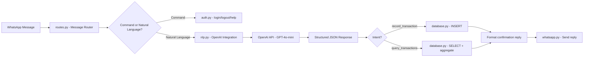

# Implementation Plan: Natural Language Integration with OpenAI

This plan covers how to integrate OpenAI's API (`api.openai.com`) into the WhatsApp Bookkeeper to enable natural language understanding of financial transactions and queries.

---

## Goal

Transform user messages like these into structured database operations:

| User Message | Parsed Action |
|---|---|
| *"I bought fuel 2k"* | `INSERT` → expense, Fuel, ₦2,000 |
| *"Paid rent 150k yesterday"* | `INSERT` → expense, Rent, ₦150,000, date: yesterday |
| *"Client sent me 50k for the logo design"* | `INSERT` → income, Freelance, ₦50,000 |
| *"How much did I spend on fuel this month?"* | `SELECT` → expenses, Fuel, current month |
| *"What's my balance?"* | `SELECT` → total income - total expenses |
| *"Show my expenses last week"* | `SELECT` → all expenses, last 7 days |

---

## Architecture



---

## Proposed Changes

### Core NLP Module

#### [NEW] [nlp.py](file:///c:/Users/chris/OneDrive/Desktop/bookkeeper/app/nlp.py)

This is the heart of the integration. It sends user messages to OpenAI and receives structured JSON back.

**Key design decisions:**
- Uses **`gpt-4o-mini`** — fast, cheap (~$0.15 per 1M input tokens), and more than capable for this structured extraction task
- Uses OpenAI's **structured output / JSON mode** to guarantee parseable responses
- The system prompt contains the list of available categories and today's date for relative date resolution ("yesterday", "last week", etc.)
- Returns a Python dictionary that the route handler can act on directly

**The system prompt will instruct GPT to return JSON in one of two formats:**

**Format 1 — Transaction Recording:**
```json
{
  "intent": "record_transaction",
  "type": "expense",
  "amount": 2000,
  "category": "Fuel",
  "description": "bought fuel",
  "date": "2026-06-02"
}
```

**Format 2 — Query / Report:**
```json
{
  "intent": "query_transactions",
  "query_type": "sum",
  "type": "expense",
  "category": "Fuel",
  "period_start": "2026-06-01",
  "period_end": "2026-06-30"
}
```

**Format 3 — Unrecognized / Casual Chat:**
```json
{
  "intent": "unknown",
  "reply": "I'm your bookkeeper! Try saying something like 'I spent 2k on fuel' or 'How much did I spend this week?'"
}
```

**Module functions:**

| Function | Purpose |
|---|---|
| `parse_message(text, categories)` | Sends user text + category list to OpenAI, returns structured dict |
| `build_system_prompt(categories)` | Constructs the system prompt with available categories and today's date |
| `get_categories_for_user(user_id)` | Fetches system + user-custom categories to feed into the prompt |

---

### Configuration

#### [MODIFY] [config.py](file:///c:/Users/chris/OneDrive/Desktop/bookkeeper/app/config.py)

Add OpenAI configuration:

```python
OPENAI_API_KEY = os.getenv("OPENAI_API_KEY")
OPENAI_MODEL = os.getenv("OPENAI_MODEL", "gpt-4o-mini")
```

---

### Message Routing

#### [MODIFY] [routes.py](file:///c:/Users/chris/OneDrive/Desktop/bookkeeper/app/routes.py)

Update the webhook POST handler to route messages through the NLP pipeline:

```
1. Receive message
2. Check for active session (auth check)
3. Check if message is a command (login, logout, help, 6-digit code)
4. If not a command → send to nlp.parse_message()
5. Based on returned intent:
   - "record_transaction" → insert into transactions table → reply with confirmation
   - "query_transactions" → query database → format results → reply
   - "unknown" → reply with the suggested help text
```

---

### Database Query Layer

#### [NEW] [queries.py](file:///c:/Users/chris/OneDrive/Desktop/bookkeeper/app/queries.py)

A dedicated module for executing bookkeeping database operations based on NLP output:

| Function | Purpose |
|---|---|
| `record_transaction(user_id, parsed)` | Inserts a transaction from NLP-parsed data |
| `query_sum(user_id, parsed)` | `SELECT SUM(amount)` with filters (category, type, date range) |
| `query_list(user_id, parsed)` | `SELECT *` transactions with filters, formatted as a list |
| `query_balance(user_id)` | Total income − total expenses |
| `format_currency(amount)` | Formats as `₦2,000` with proper comma grouping |

---

### Response Formatting

#### [NEW] [formatter.py](file:///c:/Users/chris/OneDrive/Desktop/bookkeeper/app/formatter.py)

Formats database results into clean WhatsApp-friendly replies:

| Result Type | Example Output |
|---|---|
| Transaction saved | ✅ *Recorded:* Fuel — ₦2,000 (Expense) · Jun 2, 2026 |
| Sum query | 📊 *Fuel this month:* ₦12,500 across 4 transactions |
| Balance query | 💰 *Balance:* Income ₦150,000 · Expenses ₦87,000 · Net +₦63,000 |
| List query | 📋 *Expenses last week:*\n• Fuel — ₦2,000 (Jun 1)\n• Food — ₦3,500 (Jun 2)\n• Transport — ₦800 (Jun 3) |

---

### Dependencies

#### [MODIFY] [requirements.txt](file:///c:/Users/chris/OneDrive/Desktop/bookkeeper/requirements.txt)

Add:
```
openai
```

#### [MODIFY] [.gitignore](file:///c:/Users/chris/OneDrive/Desktop/bookkeeper/.gitignore)

Ensure `.env` is already ignored (it is ✅).

---

## OpenAI System Prompt Design

This is the most critical piece. The prompt needs to be precise so GPT returns consistent, parseable JSON.

```text
You are a bookkeeping assistant that parses user messages about financial transactions.
Today's date is {today}.

AVAILABLE CATEGORIES:
{category_list}

Given a user message, determine the intent and return a JSON response.

RULES:
1. If the user is recording a transaction (spending, buying, paying, receiving, earning, etc.):
   - Set "intent" to "record_transaction"
   - Determine "type": "income" or "expense"
   - Extract "amount" as a number (convert shorthand: 2k=2000, 5h=500)
   - Match to the closest "category" from the list above. If no match, use "Other"
   - Extract a brief "description" from the message
   - Resolve "date" to YYYY-MM-DD format. Default to today. Handle "yesterday", "last Monday", etc.

2. If the user is asking a question about their finances:
   - Set "intent" to "query_transactions"
   - Set "query_type" to one of: "sum", "list", "balance", "count"
   - Set optional filters: "type", "category", "period_start", "period_end"

3. If the message doesn't relate to finances:
   - Set "intent" to "unknown"
   - Include a friendly "reply" suggesting how to use the bookkeeper

Always respond with valid JSON only. No markdown, no explanation.
```

> [!TIP]
> **Why `gpt-4o-mini`?** At ~$0.15/1M input tokens and ~$0.60/1M output tokens, processing a typical message costs less than **$0.001**. Even at 1,000 messages/day, that's under **$1/day**. It's fast (~500ms response), accurate for structured extraction, and supports JSON mode natively.

---

## File Summary

| File | Status | Purpose |
|---|---|---|
| `app/nlp.py` | **NEW** | OpenAI integration: sends messages, receives structured JSON |
| `app/queries.py` | **NEW** | Database query functions for recording and retrieving transactions |
| `app/formatter.py` | **NEW** | Formats query results into WhatsApp-friendly text |
| `app/config.py` | **MODIFY** | Add `OPENAI_API_KEY`, `OPENAI_MODEL` |
| `app/routes.py` | **MODIFY** | Route messages through NLP pipeline instead of simple shorthand parser |
| `app/database.py` | **MODIFY** | Add `transactions` and `categories` tables to `init_db()` |
| `requirements.txt` | **MODIFY** | Add `openai` dependency |

---

## Verification Plan

### Automated Tests
- Unit test `nlp.py` with sample messages to verify JSON structure:
  - `"bought fuel 2k"` → expect `{intent: "record_transaction", type: "expense", amount: 2000, category: "Fuel"}`
  - `"how much did I spend this month"` → expect `{intent: "query_transactions", query_type: "sum"}`
  - `"hello"` → expect `{intent: "unknown"}`
- Unit test `queries.py` with mock database data
- Unit test `formatter.py` with sample query results

### Integration Test
- Boot the Flask app and send test payloads to the webhook endpoint
- Verify the full pipeline: message → NLP → database → formatted reply

### Manual Verification
- Send real WhatsApp messages to the bot and verify correct responses

---

## Environment Variables Required

Add to your `.env` file:
```
OPENAI_API_KEY=sk-your-api-key-here
OPENAI_MODEL=gpt-4o-mini
```
