<!-- GENERATED — edit .claude/skills/groundwork/ instead. Synced by sync-from-dev.mjs. -->
# Harden the multi-agent conversational pipeline (off-topic guardrails, compound multi-intent execution, fuzzy inventory matching) and build a platform stakeholder dashboard for AI fleet monitoring and compliance governance.

## Goal

<!-- groundwork:auto:start goal -->
<!-- last_action: init · 2026-09-14 -->
Harden the multi-agent conversational pipeline (off-topic guardrails, compound multi-intent execution, fuzzy inventory matching) and build a platform stakeholder dashboard for AI fleet monitoring and compliance governance.
<!-- groundwork:auto:end goal -->

## Context

TaLi operates as a natural language financial OS over WhatsApp and Telegram for informal traders and small businesses. Live operational testing identified three critical conversational friction points alongside an operational blind spot:

1. **Unconstrained LLM Scope (Token & Security Leakage)**: Users submit general chat, programming questions, essay requests, or prompt injections. Unhandled requests fall through to the LLM, burning API spend and risking confusing responses.
2. **Compound Multi-Intent Dropping**: Natural business messages combining a mutation and a query (*"Sold 5 bags of rice for 30k, what is my remaining stock and today's balance?"*) parse correctly in NLP but lose the read queries in `split_routing`.
3. **Inventory False Negatives ("Item Not Found")**: Merchants asking about existing stock receive "not found" due to strict exact SQL matching (`WHERE item_name = %s`), pluralization mismatches (`egg` vs `eggs`), dual-table schema drift (`products` vs `inventory_items`), and `business_id` scoping issues.
4. **Operational Blind Spot**: Stakeholders and operators have no administrative interface to observe AI fleet performance, monitor real-time token spend against the budget ceiling, or act on high-risk transactions held in the compliance queue.

---

## Architecture (locked Round 1)

The system is organized into two primary pillars: an **Inbound Conversational Ingestion Engine** and an **Outbound Operations & Observability Web Portal**, united by the shared MySQL / SQLAlchemy persistence layer.

```mermaid
flowchart TD
    subgraph Ingestion["Conversational Engine (Chat)"]
        WA["WhatsApp / Telegram"] --> PRE["Pre-Filter Guardrails (Zero-Cost Regex)"]
        PRE -->|"Bookkeeping"| NLP["NLP Multi-Intent Parser (OpenAI / AI/ML)"]
        PRE -->|"Off-topic / Jailbreak"| REJ["Hard Rejection Template"]
        NLP --> CANON["Canonical Product Normalizer"]
        CANON --> LEDGER["agent_2_ledger.py · Propose & Multi-Write"]
        LEDGER --> COMP["compliance_agent.py · Safety Audit"]
        COMP -->|"Flagged"| REV_Q[("ReviewQueue / Pending DB")]
        COMP -->|"Approved"| DB_WRITE[("MySQL Tables")]
        DB_WRITE --> QUERY["TransactionAgent / Inventory Queries"]
        QUERY --> CFO["agent_3_cfo.py · Composite Reply Generator"]
        CFO --> WA
    end

    subgraph Observability["Stakeholder Portal (Web)"]
        ADMIN_USER["TaLi Operator / Stakeholder"] --> ADMIN_AUTH["app/admin/auth.py · Role Auth"]
        ADMIN_AUTH --> ADMIN_VIEWS["app/admin/routes.py · Flask Blueprint"]
        ADMIN_VIEWS --> FINOPS["AI Fleet & FinOps Monitor (ai_logs)"]
        ADMIN_VIEWS --> QUEUE_UI["Compliance Review Hub (ReviewQueue)"]
        ADMIN_VIEWS --> METRICS["Merchant GMV & Activity Overview"]
        QUEUE_UI -->|"Approve / Veto"| ORCH["orchestrator.py · Resume Room"]
    end
```



### Shared state contract

| Field | Type | Writer | Readers | Description |
|---|---|---|---|---|
| `known_products` | `list[str]` | Database (`inventory_items`) | `app/services/nlp.py` | Injected into NLP system prompt for entity resolution |
| `split_payload` | `dict` | `agent_2_ledger.py` | `agent_3_cfo.py` | Bundles `transactions`, `inventory`, `debts`, `query_result`, `warnings` |
| `ai_logs` | SQL table | `agent_1_intake.py` | `app/admin/routes.py` | Source for latency, model fallback ratios, token spend |
| `review_queue` | SQL table | `compliance_agent.py` | `app/admin/routes.py` | Active compliance review items requiring human intervention |

---

## Phases

### Phase 1 — Core Agent Hardening & Conversational Integrity
Deliver immediate fixes to the conversational pipeline so it is secure, robust against compound requests, and reliably resolves inventory items.
- **WP-01**: Deterministic Pre-Filter Guardrails & User Rate-Limiting.
- **WP-02**: Multi-Intent Compound Statement Execution & CFO Composite Response.
- **WP-03**: Canonical Inventory Normalization, Singular/Plural Stemming & Scoped SQL Lookup.

### Phase 2 — Platform Stakeholder & Admin Dashboard (sketch)
Provide internal operators and stakeholders with real-time operational visibility, FinOps governance, and human-in-the-loop controls.
- **WP-04**: Dedicated Flask Blueprint `app/admin/` with Secure Stakeholder Session Authentication.
- **WP-05**: AI Fleet Observability & FinOps Spend Monitoring Panel.
- **WP-06**: Interactive Compliance Review Queue UI with Agent Room Actions.

### Phase 3 — Merchant Self-Service Web Portal (stub)
A customer-facing web dashboard allowing merchants to log in via WhatsApp OTP to view interactive P&L graphs, export tax-compliant PDF/Excel statements, and manage product catalogs.

---

## Schema / Contracts

### 1. Guardrail Pre-Filter Contract
```python
OFF_TOPIC_REGEX = re.compile(
    r'\b(write\s+(?:code|python|script|essay|story|poem)|translate|homework|recipe|dan\s+mode|ignore\s+previous)\b',
    re.IGNORECASE
)
```

### 2. Composite CFO Split-Routing Payload
```python
class SplitRoutingPayload(BaseModel):
    transactions: list[TransactionResult] = []
    inventory: list[InventoryResult] = []
    debts: list[DebtResult] = []
    query_result: Optional[dict] = None  # balance, stock list, or expense query
    report_result: Optional[dict] = None
    warnings: list[str] = []
```

### 3. Multi-Tier Inventory Matcher Contract
```python
def resolve_inventory_item(user_id: str, product_name: str) -> Optional[dict]:
    """1. Exact match (LOWER) -> 2. Stemmed match (rstrip 's') -> 3. Substring LIKE -> None."""
```

### 4. Admin Dashboard Metrics Contract
```json
{
  "total_merchants": 42,
  "daily_active_merchants": 18,
  "platform_gmv_ngn": 14250000.00,
  "finops": {
    "total_spend_usd": 4.12,
    "ceiling_usd": 25.00,
    "provider_share": {"openai": 0.88, "aiml": 0.12, "featherless": 0.0},
    "p95_latency_ms": 1120
  },
  "pending_compliance_count": 3
}
```

---

## Critical Files

### Core Chat & Pipeline
- `app/agents/agent_1_intake.py` — Add pre-LLM guardrail check and abuse cooldown.
- `app/services/nlp.py` — Inject `known_products` into prompt; strengthen hard negative boundaries.
- `app/agents/agent_2_ledger.py` — Add query execution inside `split_routing`; use fuzzy inventory lookup.
- `app/agents/agent_3_cfo.py` — Support query/report results in `split_routing` reply formatter.
- `app/data/queries.py` — Implement `resolve_inventory_item()` with multi-tier matching and user-scoped stock queries.
- `app/agents/inventory_agent.py` — Replace strict `= %s` SQL with fuzzy matcher.

### Stakeholder Portal
- `app/admin/__init__.py` — Blueprint initialization.
- `app/admin/routes.py` — Dashboard, FinOps, and compliance endpoints.
- `app/admin/auth.py` — Stakeholder credentials check and session management.
- `app/templates/admin/layout.html` — Base layout with Tailwind and Chart.js.
- `app/templates/admin/dashboard.html` — High-level metrics and AI fleet observability charts.
- `app/templates/admin/compliance.html` — Interactive compliance review queue.

---

## Reuse Map

| Concern | Strategy | Source / Target | Notes |
|---|---|---|---|
| Response Schema | **Extend** | `app/services/validators.py` | Add `query_result` to split routing model |
| Stock Calculation | **Reuse** | `app/data/queries.py:query_stock_levels` | Use as authoritative stock balance query |
| AI Logging | **Reuse** | `app/data/models.py:AiLog` | Query directly for FinOps analytics in admin dashboard |
| Compliance Queue | **Reuse** | `app/data/models.py:ReviewQueue` | Web UI reads and resolves rows created by Compliance Agent |
| Styling / Charts | **Net-zero-fork** | Tailwind CSS CDN + Chart.js CDN | Self-contained in admin templates; no node build step |

---

## Risks + Alternatives

1. **Risk: Guardrail False Positives Rejecting Real Transactions**
   - *Scenario*: A merchant sells "poems" or "recipes" as goods.
   - *Mitigation*: The pre-filter only flags prompts *requesting* actions (e.g. `write a poem`, `generate code`), while sales syntax (`sold 3 books`, `bought recipe book 2k`) passes through to transaction fast-paths.
2. **Risk: Inventory Fuzzy Over-Matching**
   - *Scenario*: User has `"peak milk"` and `"fresh cow milk"`. Input `"milk"` is ambiguous.
   - *Mitigation*: If multiple existing items share the same substring score, return a clarification prompt asking the user to choose between the matching items.
3. **Risk: Admin Dashboard Security & Multi-Tenant Isolation**
   - *Scenario*: Unauthorized access to aggregate business metrics or cross-merchant data leakage.
   - *Mitigation*: Dedicated stakeholder authentication with bcrypt password hashing, CSRF protection, and strictly separate session cookies from chat sessions.

---

## ID Registry

<!-- groundwork:auto:start ids -->
<!-- last_action: review · 2026-09-14T18:12:52Z -->
- `G-01` · Conversational guardrails & prompt abuse defense · `04-discussion.md` (Round 1)
- `G-02` · Multi-intent compound statement execution & CFO formatting · `04-discussion.md` (Round 1)
- `G-03` · Robust inventory canonicalization & fuzzy SQL lookup · `04-discussion.md` (Round 1)
- `G-04` · Platform stakeholder & AI fleet observability dashboard · `04-discussion.md` (Round 1)
- `G-05` · Pidgin & colloquial defense against guardrail false positives · `04-discussion.md` (Round 2)
- `G-06` · Compound statement atomic rollback on partial mutation failure · `04-discussion.md` (Round 2)
- `G-07` · Multi-match disambiguation for fuzzy inventory items · `04-discussion.md` (Round 2)
- `G-08` · Stakeholder admin authentication security & cookie hardening · `04-discussion.md` (Round 2)
- `WP-01` · Conversational guardrail pre-filter & abuse throttling · `05-tracking.md` (Wave 1)
- `WP-02` · Multi-intent split routing execution & composite reply · `05-tracking.md` (Wave 2)
- `WP-03` · Canonical inventory prompt injection & fuzzy SQL lookup · `05-tracking.md` (Wave 1)
- `WP-04` · Admin blueprint setup & stakeholder authentication · `05-tracking.md` (Wave 3)
- `WP-05` · AI fleet observability & FinOps monitoring panel · `05-tracking.md` (Wave 4)
- `WP-06` · Compliance review queue management UI · `05-tracking.md` (Wave 4)
<!-- groundwork:auto:end ids -->

---

## Verification

### Phase 1 Verification
1. **Guardrail Unit Tests**: Verify that off-topic queries (`"write python script"`, `"write an essay"`) are rejected instantly with zero LLM API calls, while bookkeeping queries pass unaffected.
2. **Compound Statement Tests**: Verify that a compound message (`"Sold 5 bags of rice 30k, how many bags left and what is my balance?"`) writes the sale, decrements stock, queries balance, and returns a single 3-part reply.
3. **Inventory Matching Tests**: Verify that `"how much rice left"` accurately matches `"50kg bag of rice"`, and plural queries (`"eggs"`) accurately match `"egg"`.
4. **Full Test Suite**: All 212+ pytest unit and integration tests continue to pass offline.

### Phase 2 Verification (sketch)
1. **Admin Auth Test**: Verify unauthorized requests to `/admin/` redirect to `/admin/login`.
2. **FinOps Calculation Test**: Verify that token usage and cost metrics computed on `ai_logs` match actual router records.
3. **Compliance Action Test**: Verify approving a transaction in the web UI updates its status and fires the agent room resumption event.

