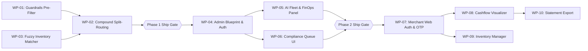

<!-- GENERATED — edit .claude/skills/groundwork/ instead. Synced by sync-from-dev.mjs. -->
# Harden the multi-agent conversational pipeline (off-topic guardrails, compound multi-intent execution, fuzzy inventory matching) and build a platform stakeholder dashboard for AI fleet monitoring and compliance governance. — tracking

Work packages, dependencies, critical path. Source of truth for execution status (survives sessions).

> Only the orchestrator writes the status checkboxes below. WP owners report Definition-of-Done back; the orchestrator records the result.

Status legend: `[ ]` not started · `[~]` in progress · `[x]` done · `[!]` blocked

<!-- groundwork:auto:start round-fold -->
<!-- last_action: review · 2026-09-14T17:09:32Z -->
Round 1 folded four core gaps into concrete work packages: G-01 (guardrails pre-filter) → WP-01; G-02 (compound statement split-routing) → WP-02; G-03 (fuzzy inventory matching) → WP-03; G-04 (stakeholder & FinOps dashboard) → WP-04/05/06. Phase 1 targets immediate conversational stability; Phase 2 builds the stakeholder platform portal.
<!-- groundwork:auto:end round-fold -->

---

## Critical path

```
WP-01 (Guardrails) & WP-03 (Inventory Matcher) ──► WP-02 (Compound Split-Routing) ──► Phase 1 Gate
                                                                                          │
                                                                                          ▼
WP-04 (Admin Blueprint & Auth) ──► WP-05 (AI Observability) & WP-06 (Compliance Hub) ──► Phase 2 Gate
                                                                                          │
                                                                                          ▼
WP-07 (Merchant Portal Auth & OTP) ──► WP-08 (Cashflow Visualizer) & WP-09 (Catalog/Inventory) ──► WP-10 (Statement Export)
```

**Parallel tracks**:
- In Phase 1: `WP-01` (Guardrails) and `WP-03` (Fuzzy Inventory) are completely independent and run in parallel; `WP-02` (Compound Routing) consumes their outputs.
- In Phase 2: Once `WP-04` (Admin Blueprint & Auth) lands, `WP-05` (FinOps) and `WP-06` (Compliance Hub) execute concurrently.
- In Phase 3: Once `WP-07` (Merchant Portal Auth & OTP) lands, `WP-08` (Cashflow & Ledger) and `WP-09` (Catalog & Inventory) can run in parallel, converging into `WP-10` (Statement Generator).

---

## How to use this file

- Each section below is one work package — its goal, files, deps, DoD.
- The matrix + wave plan + critical path are generated by `groundwork orchestrate` from these sections.
- Add a WP: write a `## WP-NN — title` section; orchestrate picks it up on next run.

## Work-package matrix

<!-- groundwork:auto:start wp-matrix -->
| WP | Title | Wave | Status | Depends on | Gate | Tier |
|---|---|---|---|---|---|---|
| `WP-01` | Conversational Guardrail Pre-Filter & Throttling | 1 | `[x]` | — | — | sonnet |
| `WP-02` | Multi-Intent Compound Split-Routing & Composite CFO | 2 | `[x]` | `WP-01`, `WP-03` | `G-COMPOSITE-PAYLOAD` | sonnet |
| `WP-03` | Canonical Inventory Prompt Injection & Fuzzy SQL Matcher | 1 | `[x]` | — | `G-INVENTORY-SEAM` | sonnet |
| `WP-04` | Admin Flask Blueprint & Stakeholder Session Auth | 3 | `[x]` | `WP-02` | `G-ADMIN-AUTH` | sonnet |
| `WP-05` | AI Fleet Observability & FinOps Spend Panel | 4 | `[x]` | `WP-04` | — | sonnet |
| `WP-06` | Compliance Review Queue Web Hub & Room Resumption | 4 | `[x]` | `WP-04` | `G-COMPLIANCE-ACTION` | sonnet |
| `WP-07` | Merchant Web Session Auth & WhatsApp OTP Verification | 5 | `[x]` | `WP-04` | `G-MERCHANT-AUTH` | sonnet |
| `WP-08` | Merchant Cashflow & Ledger Visualizer | 6 | `[x]` | `WP-07` | — | sonnet |
| `WP-09` | Self-Service Catalog & Inventory Manager | 6 | `[ ]` | `WP-07` | — | sonnet |
| `WP-10` | On-demand Statement Generator (PDF & Excel Export) | 7 | `[ ]` | `WP-08` | `G-STATEMENT-EXPORT` | sonnet |
<!-- groundwork:auto:end wp-matrix -->

## Wave plan

<!-- groundwork:auto:start wave-plan -->
- **Wave 1 (Independent Agent Hardening)**: `WP-01` (Guardrails Pre-Filter) + `WP-03` (Inventory Canonicalization & Fuzzy Matcher)
- **Wave 2 (Composite Integration)**: `WP-02` (Multi-Intent Compound Statement Execution & CFO Formatting)
- **Wave 3 (Admin Portal Foundation)**: `WP-04` (Admin Blueprint, Stakeholder Auth, Layout Template)
- **Wave 4 (Platform Observability & Governance)**: `WP-05` (FinOps & AI Fleet Dashboard) + `WP-06` (Compliance Review Queue UI)
- **Wave 5 (Merchant Portal Foundation)**: `WP-07` (Merchant Web Session Auth & WhatsApp OTP)
- **Wave 6 (Merchant Dashboard Core)**: `WP-08` (Merchant Cashflow & Ledger Visualizer) + `WP-09` (Catalog & Inventory Manager)
- **Wave 7 (Financial Export)**: `WP-10` (Statement Generator & Export)
<!-- groundwork:auto:end wave-plan -->

## Critical-path graph

<!-- groundwork:auto:start critical-path -->

<!-- groundwork:auto:end critical-path -->

---

## Work packages, grouped by phase

## Phase 1 — Core Agent Hardening & Conversational Integrity

### WP-01 — Conversational Guardrail Pre-Filter & Throttling

- **Goal:** Intercept off-topic queries (code, essays, stories, translations, jailbreaks) before invoking the LLM; throttle users who spam unrecognized queries.
- **Depends on:** None (starts immediately in Wave 1).
- **Files (create/touch):**
  - `app/agents/agent_1_intake.py` — Add regex pre-filter in `process()`; implement session cooldown check.
  - `app/services/nlp.py` — Harden system prompt negative boundary for "unknown" classification.
  - `tests/test_guardrails.py` (new) — Unit tests for off-topic interception and abuse cooldown.
- **DoD (self-verifiable):**
  1. Off-topic queries ("write python code", "translate to spanish", "write an essay on finance") return immediate friendly bookkeeping guidance with zero LLM API calls.
  2. Legitimate bookkeeping entries ("sold 2 bags rice 10k", "bought fuel 3k", "how much in stock") pass through unaffected.
  3. 3 consecutive off-topic inputs place the sender on a 10-minute LLM cooldown.
  4. 100% test pass on `pytest tests/test_guardrails.py`.

### WP-02 — Multi-Intent Compound Statement Execution & Composite CFO

- **Goal:** Execute both mutating writes and read queries when present in compound statements; deliver structured composite replies via CFO Agent.
- **Depends on:** `WP-01`, `WP-03`.
- **Files (create/touch):**
  - `app/services/validators.py` — Add `query_result` and `report_result` fields to `UnifiedResponseModel`.
  - `app/agents/agent_2_ledger.py` — In `split_routing`, execute `TransactionAgent.query()` or report generation after writing mutating entries; pack results into payload.
  - `app/agents/agent_3_cfo.py` — In `split_routing`, format multi-part composite reply (Recorded ✅, Inventory 📦, Balance/Report 📊).
  - `tests/test_compound_messages.py` (new) — Integration tests covering compound sentences.
- **DoD (self-verifiable):**
  1. Utterance *"Sold 5 bags of rice 30k, how many bags left and what is my balance?"* writes the sale, decrements 5 bags, queries remaining stock, queries balance, and returns a single reply with all 3 answers.
  2. Pending confirmation holding a mutating entry preserves and executes any bundled read query upon user confirmation (`YES`).
  3. Existing single-intent transactions continue to format identically without regression.

### WP-03 — Canonical Inventory Prompt Injection & Fuzzy SQL Matcher

- **Goal:** Eliminate "item not found" errors on existing stock by injecting known product names into the NLP prompt and using multi-tier fuzzy/stemmed SQL lookups.
- **Depends on:** None (starts immediately in Wave 1).
- **Files (create/touch):**
  - `app/data/queries.py` — Implement `get_user_product_names(user_id)` and `resolve_inventory_item(user_id, item_name)` with multi-tier fallback (exact -> lower -> stem -> `LIKE %s`).
  - `app/services/nlp.py` — Inject `AVAILABLE PRODUCTS: [...]` into `build_system_prompt()`.
  - `app/agents/agent_2_ledger.py` — Use `resolve_inventory_item()` for item lookup and stock checks; ensure `user_id` scoping.
  - `app/agents/inventory_agent.py` — Use `resolve_inventory_item()` for stock queries.
  - `tests/test_inventory_fuzzy.py` (new) — Unit tests covering singular/plural, casing, and substring matches.
- **DoD (self-verifiable):**
  1. Item created as `"50kg bag of rice"` is successfully matched when user queries *"how much rice left"*.
  2. Pluralized queries (*"eggs"*) successfully match item stored as `"egg"`.
  3. Querying stock levels returns all items scoped by `user_id` regardless of `business_id` NULL status.

---

## Phase 2 — Platform Stakeholder & Admin Dashboard (sketch)

### WP-04 — Admin Flask Blueprint & Stakeholder Session Auth

- **Goal:** Scaffold the `/admin/` blueprint, base layout, and password-authenticated stakeholder session system.
- **Depends on:** `WP-02` (Phase 1 complete).
- **Files (create/touch):**
  - `app/admin/__init__.py` (new) — Blueprint definition.
  - `app/admin/routes.py` (new) — Login, logout, and dashboard shell routes.
  - `app/admin/auth.py` (new) — Stakeholder password verification and `@admin_required` decorator.
  - `app/templates/admin/layout.html` (new) — Base template with Tailwind CSS and Chart.js.
  - `app/templates/admin/login.html` (new) — Admin login view.
- **DoD (self-verifiable):**
  1. Visiting `/admin/` unauthenticated redirects to `/admin/login`.
  2. Valid stakeholder credentials create a secure session and redirect to `/admin/dashboard`.
  3. Logout invalidates session immediately.

### WP-05 — AI Fleet Observability & FinOps Spend Panel

- **Goal:** Surface real-time model usage, provider fallback ratios (OpenAI vs AI/ML API), latency distribution, and spend tracking vs ceiling.
- **Depends on:** `WP-04`.
- **Files (create/touch):**
  - `app/admin/routes.py` — Aggregate queries on `ai_logs` and `transactions`.
  - `app/templates/admin/dashboard.html` (new) — Metrics cards and Chart.js visualizations.
- **DoD (self-verifiable):**
  1. Dashboard displays: Total spend ($) vs budget ceiling, provider distribution pie chart, p95 latency, and platform GMV.
  2. Data accurately matches underlying `ai_logs` and `transactions` tables.

### WP-06 — Compliance Review Queue Web Hub & Room Resumption

- **Goal:** Provide a web interface for compliance officers to inspect flagged transactions and approve or reject them with agent room resumption.
- **Depends on:** `WP-04`.
- **Files (create/touch):**
  - `app/admin/routes.py` — Add `/admin/compliance` list and `/admin/compliance/<id>/action` endpoints.
  - `app/templates/admin/compliance.html` (new) — Review table with approve/reject buttons.
  - `app/agents/orchestrator.py` — Post approval/veto events to room on compliance web action.
- **DoD (self-verifiable):**
  1. Web table lists all items currently in `ReviewQueue`.
  2. Clicking "Approve" marks the item resolved, posts an approval event to the agent room, and updates the UI via HTMX.

---

## Phase 3 — Merchant Self-Service Web Portal

### WP-07 — Merchant Web Session Auth & WhatsApp OTP Verification

- **Goal:** Allow registered merchants to authenticate into the web portal via phone number and one-time passcode (OTP) delivered via WhatsApp / dev bypass. Scaffold dedicated `/portal/` blueprint with `@merchant_required` decorator and secure session management.
- **Depends on:** `WP-04` (Phase 2 complete).
- **Files (create/touch):**
  - `app/portal/__init__.py` (new) — Dedicated `portal_bp` blueprint.
  - `app/portal/auth.py` (new) — Merchant session store, WhatsApp OTP generation/verification, rate limiting, and `@merchant_required` decorator.
  - `app/portal/routes.py` (new) — `/portal/login`, `/portal/verify-otp`, `/portal/logout`, `/portal/dashboard` shell.
  - `app/templates/portal/layout.html` (new) — Base merchant portal layout adhering to Obsidian theme, Fraunces serif headings, and Hanken Grotesk numbers.
  - `app/templates/portal/login.html` (new) — Phone input and OTP verification interface with resend countdown.
  - `app/templates/portal/dashboard.html` (new) — Merchant dashboard shell.
  - `app/__init__.py` — Register `portal_bp`.
  - `tests/test_portal_auth.py` (new) — Full unit tests for login, OTP verification, session cookies, rate-limiting, and logout.
- **DoD (self-verifiable):**
  1. Visiting `/portal/` unauthenticated redirects to `/portal/login`.
  2. Requesting an OTP sends a 6-digit code to the merchant's WhatsApp (or dev bypass); submitting the valid code authenticates the session and redirects to `/portal/dashboard`.
  3. Non-registered phone numbers receive clear guidance to register.
  4. Exceeded OTP attempts (3 failed) lock the phone for 10 minutes.
  5. Session cookies use `HttpOnly=True`, `SameSite='Lax'`, and expire on logout.
  6. 100% test pass on `pytest tests/test_portal_auth.py`.

### WP-08 — Merchant Cashflow & Ledger Visualizer

- **Goal:** Surface personal merchant financial health metrics (Total Revenue, Total Expenses, Net Cashflow, Today's Sales, Pending Debt Balances) with interactive cashflow charts and a filterable ledger transaction table.
- **Depends on:** `WP-07`.
- **Files (create/touch):**
  - `app/portal/metrics.py` (new) — Aggregations strictly scoped by `user_id` on `transactions` and `debts`.
  - `app/portal/routes.py` — Add `/portal/transactions` list endpoint and cashflow data provider.
  - `app/templates/portal/dashboard.html` — Chart.js cashflow charts and summary cards.
  - `app/templates/portal/transactions.html` (new) — Searchable/filterable ledger table.
  - `tests/test_portal_metrics.py` (new) — Tests for user isolation, date range filtering, empty state handling, and GMV calculations.
- **DoD (self-verifiable):**
  1. Dashboard displays: Total Sales, Total Expenses, Net Cashflow, and Debts Receivable/Payable.
  2. Chart.js renders daily/weekly revenue vs expense bars.
  3. Ledger table supports category and transaction type filtering.
  4. 100% test pass on `pytest tests/test_portal_metrics.py`.

### WP-09 — Self-Service Catalog & Inventory Manager

- **Goal:** Allow merchants to browse their inventory stock, edit product names and prices, record restocking or quantity adjustments, and view low-stock warnings directly on the web.
- **Depends on:** `WP-07`.
- **Files (create/touch):**
  - `app/portal/inventory.py` (new) — Inventory management queries and mutations (`inventory_items`).
  - `app/portal/routes.py` — Add `/portal/inventory`, `/portal/inventory/add`, `/portal/inventory/<id>/adjust`.
  - `app/templates/portal/inventory.html` (new) — Inventory management table with restock and edit forms.
  - `tests/test_portal_inventory.py` (new) — Tests for item listing, stock adjustments, and multi-tenant isolation.
- **DoD (self-verifiable):**
  1. Merchant can view all stocked products with current quantities, unit prices, and low-stock badges.
  2. Merchant can add a new item or adjust stock directly from the web interface.
  3. All operations are strictly multi-tenant isolated by `user_id`.
  4. 100% test pass on `pytest tests/test_portal_inventory.py`.

### WP-10 — On-demand Statement Generator (PDF & Excel Export)

- **Goal:** Provide instant export and download of branded financial statements in PDF and CSV/Excel formats for tax compliance, bank loans, and audit records.
- **Depends on:** `WP-08`.
- **Files (create/touch):**
  - `app/portal/statement.py` (new) — Statement generator generating CSV and PDF formats for merchant transactions.
  - `app/portal/routes.py` — Add `/portal/statement` view and `/portal/statement/export` download handler.
  - `app/templates/portal/statement.html` (new) — Statement period selector and export preview.
  - `tests/test_portal_statement.py` (new) — Tests for CSV/PDF export, date bounding, and data integrity.
- **DoD (self-verifiable):**
  1. Merchant can select a date range (This Month, Last Month, Custom) and download a CSV/Excel statement.
  2. Merchant can export a branded PDF statement.
  3. Data in statements matches underlying ledger transactions precisely.
  4. 100% test pass on `pytest tests/test_portal_statement.py`.


