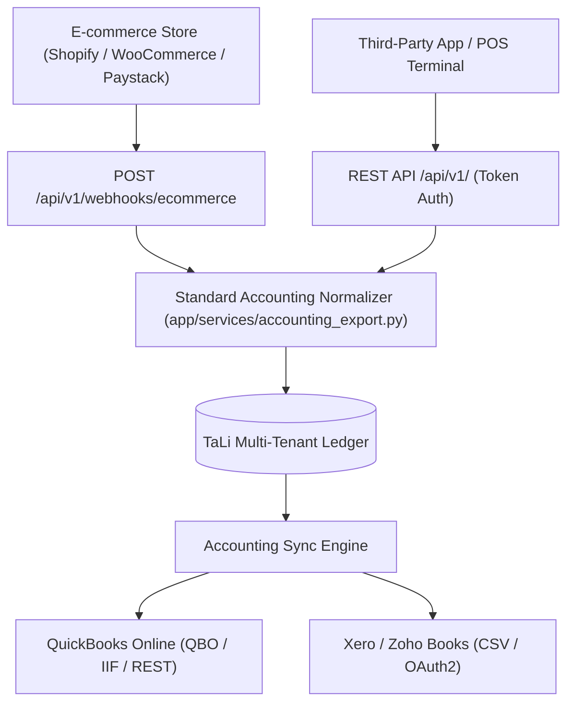

# External Accounting Integrations & Public Developer API

## Goal

<!-- groundwork:auto:start goal -->
<!-- last_action: init · 2026-09-29 -->
Build accounting ledger normalizer for QuickBooks/Xero/Zoho sync, public developer REST API, and e-commerce webhooks
<!-- groundwork:auto:end goal -->

## Context

To embed TaLi into the broader financial ecosystem, merchants need automated sync with standard accounting packages (QuickBooks Online, Xero, Zoho Books) and developer APIs/webhooks so online storefronts (Shopify, WooCommerce, Paystack Storefront) auto-record sales into TaLi.

## Architecture

### Shared State Contract

| Field | Type | Writer | Readers | Description |
|---|---|---|---|---|
| `event_id` | `str` | Channel Webhook / API / MCP | Ledger / Database | Unique idempotency reference |
| `merchant_id` | `UUID` | Auth / Channel Resolver | Handlers | Authenticated tenant context |
| `operator_id` | `str` | Admin Auth / MCP Client | Audit Trail | Originating operator identity |

## Phases & Work Packages

### Phase 1 — Core Implementation & Multi-Channel Delivery
- **WP-01**: Standard Accounting Ledger Schema Normalizer — Map TaLi single-entry sales/expenses into double-entry chart of accounts (Assets, Liabilities, Equity, Revenue, COGS).
- **WP-02**: QuickBooks Online & Xero Export Adapters — Implement batch export generators for QuickBooks (IIF/QBO format) and Xero/Zoho Books (CSV format).
- **WP-03**: Public Merchant Developer REST API (v1) — Build bearer-token authenticated REST endpoints (/api/v1/transactions, /api/v1/inventory, /api/v1/debts).
- **WP-04**: Inbound E-Commerce Webhook Ingestors (Shopify & WooCommerce) — Handle incoming order webhooks from Shopify, WooCommerce, and Paystack Storefront to auto-log sales.
- **WP-05**: Accounting Integrations & Public API Test Suite — Add tests validating chart of accounts balance, developer API rate limiting, and webhook ingest accuracy.

## UI & Visual Design Constraints

When implementing screens, cards, modals, or views:
- **Mandatory Skills**: `impeccable` and `huashu-design` MUST be used for UI layout, styling, and prototype reviews.
- **Prohibited**:
  - Emojis are strictly prohibited in all UI copy, buttons, headers, cards, and tooltips. Use clean SVG icons (Lucide / Heroicons) instead.
  - Em dashes (`—`) are strictly prohibited in all UI text and labels. Use clean hyphens (`-`) or colons (`:`).
- **Visual Assets**: Real screenshots/photos, vector illustrations (such as unDraw at `undraw.co`), and AI-generated images are permitted.

## Critical Files

- `app/services/accounting_export.py`
- `app/services/integrations/quickbooks.py`
- `app/web/api_v1.py`
- `app/web/ecommerce_webhooks.py`
- `tests/test_accounting_api.py`
