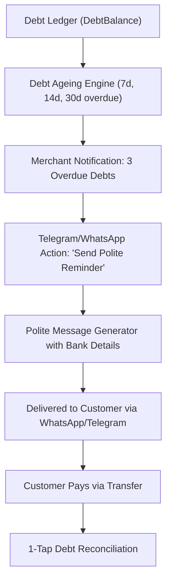

# Automated Debt Recovery Engine ('Polite Debt Collector')

## Goal

<!-- groundwork:auto:start goal -->
<!-- last_action: init · 2026-09-29 -->
Automate customer credit tracking and polite one-tap WhatsApp and Telegram debt reminders with merchant bank details
<!-- groundwork:auto:end goal -->

## Context

Customer debt ('I will pay you tomorrow') is the single greatest cause of cashflow failure for informal African retail. Merchants feel uncomfortable asking for money because of social awkwardness. An automated, neutral, and polite system acts as the firm financial auditor, recovering debts without damaging personal relationships.

## Architecture

### Shared State Contract

| Field | Type | Writer | Readers | Description |
|---|---|---|---|---|
| `event_id` | `str` | Channel Webhook | Ledger / Database | Unique idempotency reference |
| `merchant_id` | `UUID` | Auth / Channel Resolver | Handlers | Authenticated tenant context |
| `channel_type` | `str` | Webhook Router | Dispatchers | 'whatsapp' or 'telegram' |

## Phases & Work Packages

### Phase 1 — Core Implementation & Multi-Channel Delivery
- **WP-01**: Debt Ageing & Risk Evaluation Service — Build `app/services/debt_recovery.py` to calculate overdue buckets (7d, 14d, 30d+) and generate risk scores.
- **WP-02**: Polite Reminder Template Generator — Implement localized, courteous reminder message formats with merchant bank account payment details.
- **WP-03**: Telegram Interactive Debt Inline Keyboard — Add clickable buttons on overdue alerts ('Remind Customer', 'Record Full Payment', 'Waive').
- **WP-04**: One-Tap WhatsApp Debt Follow-Up Flow — Provide pre-formatted WhatsApp share links and direct chat dispatch for customer debt notifications.
- **WP-05**: Debt Recovery & Audit Test Suite — Add unit and integration tests covering ageing math, reminder generation, and repayment state transitions.

## Critical Files

- `app/channels/telegram.py`
- `app/web/`
- `app/data/models.py`
- `app/portal/`
- `tests/`
