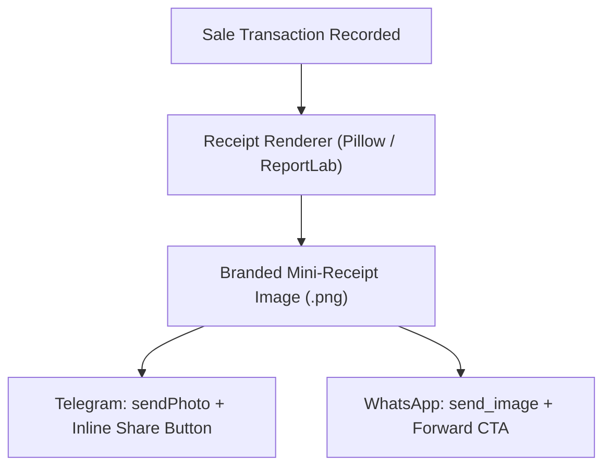

# Branded Digital E-Receipts & 1-Tap Sharing

## Goal

<!-- groundwork:auto:start goal -->
<!-- last_action: init · 2026-09-29 -->
Generate branded visual digital receipts and PDF invoices with one-tap WhatsApp and Telegram forwarding
<!-- groundwork:auto:end goal -->

## Context

Merchants want their business to look established and reputable. Customers demand proof of purchase. Generating professional, high-aesthetic digital receipts with the store's name, logo/avatar, and transaction details creates trust and turns every customer into an organic marketer for TaLi.

## Architecture

### Shared State Contract

| Field | Type | Writer | Readers | Description |
|---|---|---|---|---|
| `event_id` | `str` | Channel Webhook | Ledger / Database | Unique idempotency reference |
| `merchant_id` | `UUID` | Auth / Channel Resolver | Handlers | Authenticated tenant context |
| `channel_type` | `str` | Webhook Router | Dispatchers | 'whatsapp' or 'telegram' |

## Phases & Work Packages

### Phase 1 — Core Implementation & Multi-Channel Delivery
- **WP-01**: Digital Receipt Rendering Engine — Create `app/services/receipt_renderer.py` generating compact, branded PNG and PDF receipts using Pillow/ReportLab.
- **WP-02**: Merchant Branding & Template Customization — Allow merchants to configure business name, phone, address, and receipt footer notes via chat/portal.
- **WP-03**: Telegram Native Share & Inline Keyboard Action — Attach inline keyboard buttons ('Share Receipt', 'Download PDF') beneath sale confirmations in Telegram.
- **WP-04**: WhatsApp Digital Receipt Delivery — Send branded receipt image in WhatsApp with one-tap forward prompt upon completing a sale.
- **WP-05**: Receipt Generation Test Coverage — Add unit tests verifying receipt rendering, currency formatting, and multi-channel message dispatch.

## Critical Files

- `app/channels/telegram.py`
- `app/web/`
- `app/data/models.py`
- `app/portal/`
- `tests/`
