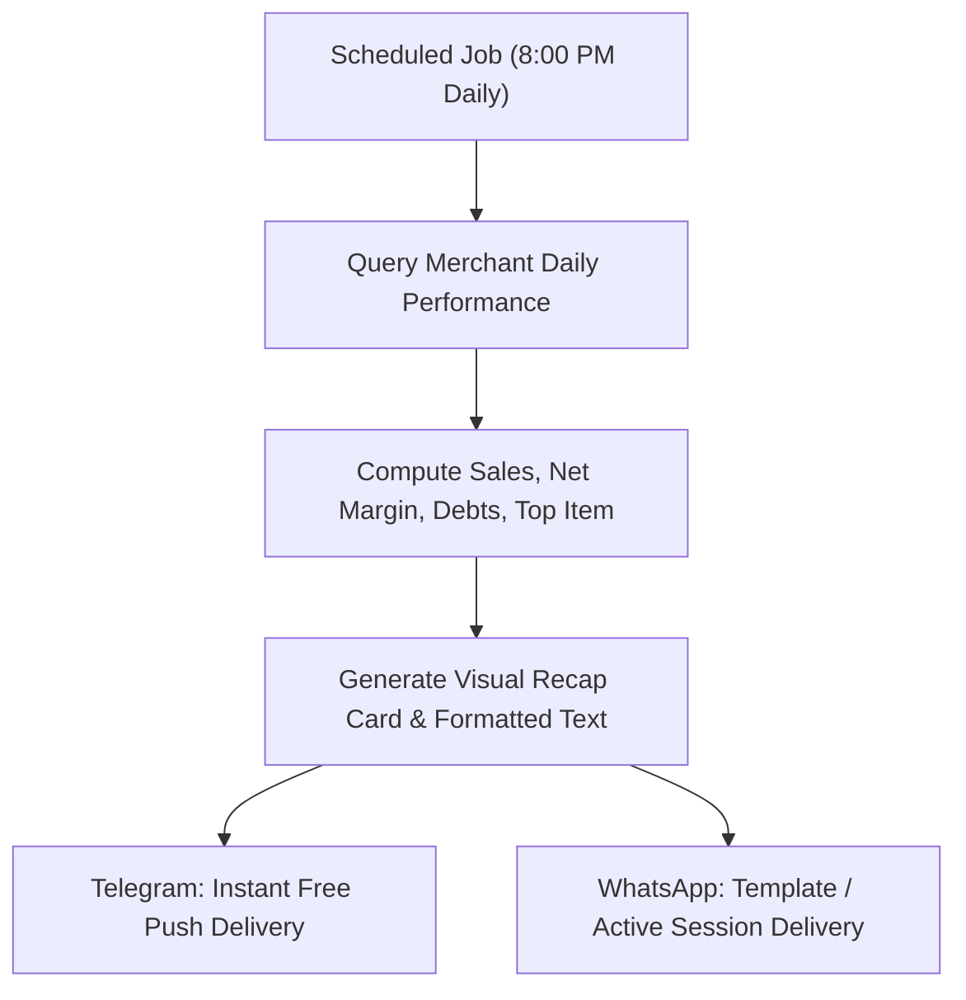

# End-of-Day 'Daily Victory' Recap & Gamification

## Goal

<!-- groundwork:auto:start goal -->
<!-- last_action: init · 2026-09-29 -->
Deliver automated 8:00 PM evening sales summaries, cashflow recaps, and motivational milestones to merchants
<!-- groundwork:auto:end goal -->

## Context

Shopkeepers work long, arduous hours. Delivering an automated 8:00 PM 'Daily Victory' summary provides instant clarity on profit, cash collected, and outstanding receivables, while gamifying daily milestones to build long-term retention and positive reinforcement.

## Architecture

### Shared State Contract

| Field | Type | Writer | Readers | Description |
|---|---|---|---|---|
| `event_id` | `str` | Channel Webhook | Ledger / Database | Unique idempotency reference |
| `merchant_id` | `UUID` | Auth / Channel Resolver | Handlers | Authenticated tenant context |
| `channel_type` | `str` | Webhook Router | Dispatchers | 'whatsapp' or 'telegram' |

## Phases & Work Packages

### Phase 1 — Core Implementation & Multi-Channel Delivery
- **WP-01**: Daily Performance Rollup Aggregator — Build `app/services/daily_recap.py` to aggregate daily revenue, cashflow, debt movements, and top items.
- **WP-02**: Engaging Message & Visual Card Formatter — Design friendly, celebratory text templates and lightweight visual summary cards with motivational milestones.
- **WP-03**: Multi-Channel Broadcast Dispatcher — Implement scheduled delivery engine routing via Telegram Bot API and WhatsApp Cloud API.
- **WP-04**: Merchant Notification Preferences — Add settings in chat/portal allowing merchants to adjust recap time or opt out.
- **WP-05**: Daily Recap Test Coverage — Add unit tests verifying metric rollup calculations, milestone logic, and channel broadcast formatting.

## Critical Files

- `app/channels/telegram.py`
- `app/web/`
- `app/data/models.py`
- `app/portal/`
- `tests/`
