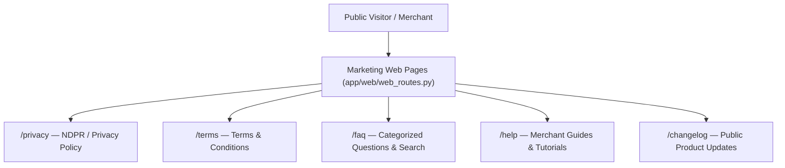

# Marketing Site Expansion & Trust Center

## Goal

<!-- groundwork:auto:start goal -->
<!-- last_action: init · 2026-09-29 -->
Expand public marketing site with Privacy Policy, Terms of Service, FAQ, Help Center, and Public Changelog
<!-- groundwork:auto:end goal -->

## Context

Before scaling customer acquisition and submitting for WhatsApp Business API verification, TaLi requires complete trust and transparency infrastructure: NDPR-compliant Privacy Policy, Terms of Service, searchable FAQ, Help Center guides, and a public product Changelog to showcase continuous innovation.

## Architecture

### Shared State Contract

| Field | Type | Writer | Readers | Description |
|---|---|---|---|---|
| `event_id` | `str` | Channel Webhook | Ledger / Database | Unique idempotency reference |
| `merchant_id` | `UUID` | Auth / Channel Resolver | Handlers | Authenticated tenant context |
| `channel_type` | `str` | Webhook Router | Dispatchers | 'whatsapp' or 'telegram' |

## Phases & Work Packages

### Phase 1 — Core Implementation & Multi-Channel Delivery
- **WP-01**: NDPR-Compliant Privacy Policy & Terms of Service — Author and implement legally sound Privacy Policy and Terms of Service templates in `app/templates/legal/`.
- **WP-02**: Interactive Categorized FAQ Page — Create searchable, accordion-based FAQ page addressing security, pricing, and messaging channel commands.
- **WP-03**: Help Center & Knowledge Base Hub — Build structured guides page with step-by-step visual tutorials for onboarding and core bookkeeping actions.
- **WP-04**: Public Product Changelog & Release Notes Feed — Implement dynamic changelog template showcasing weekly feature releases, improvements, and fixes.
- **WP-05**: Marketing Navigation, SEO & Metadata Polish — Update global headers/footers with legal links, OpenGraph social preview cards, and mobile navigation.

## UI & Visual Design Constraints

When implementing marketing, legal, FAQ, Help Center, and Changelog pages:
- **Mandatory Skills**: `impeccable` and `huashu-design` MUST be used for page architecture, responsive layout, and typography.
- **Prohibited**:
  - Emojis are strictly prohibited in all UI copy, headings, buttons, cards, and FAQs. Use clean SVG icons (Lucide / Heroicons) instead.
  - Em dashes (`—`) are strictly prohibited in all UI text, headings, and marketing copy. Use clean hyphens (`-`) or colons (`:`).
- **Visual Assets**: Real photography, vector illustrations (such as unDraw at `undraw.co`), and AI-generated images are permitted.

## Critical Files

- `app/web/web_routes.py`
- `app/templates/`
- `tests/test_web_onboarding.py`
