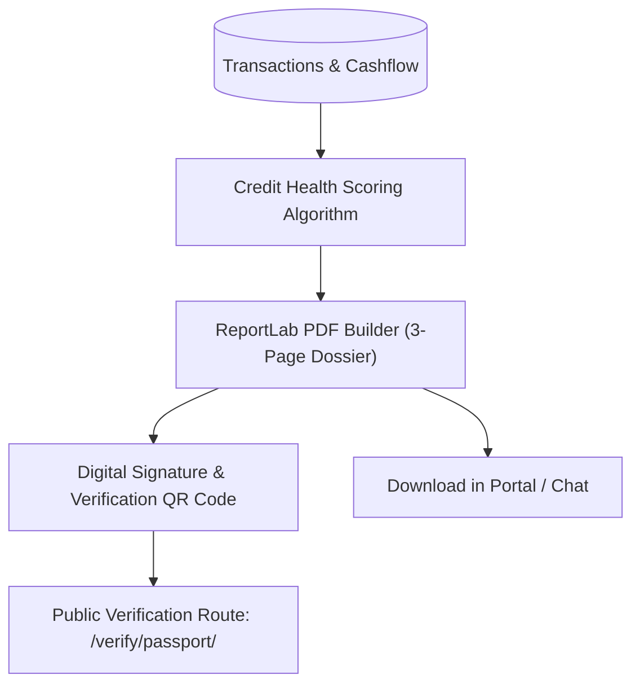

# Merchant Credit Passport & Loan Readiness Dossier

## Goal

<!-- groundwork:auto:start goal -->
<!-- last_action: init · 2026-09-29 -->
Generate certified bank-grade 3-page financial health dossiers with QR code verification for MSME loan readiness
<!-- groundwork:auto:end goal -->

## Context

Micro and small enterprises cannot access commercial loans or fintech credit lines because they lack audited financial statements. By packaging 90-day cashflow velocity, consistency scores, and inventory turnover into a standardized, tamper-evident Credit Passport, TaLi unlocks working capital for merchants.

## Architecture

### Shared State Contract

| Field | Type | Writer | Readers | Description |
|---|---|---|---|---|
| `event_id` | `str` | Channel Webhook | Ledger / Database | Unique idempotency reference |
| `merchant_id` | `UUID` | Auth / Channel Resolver | Handlers | Authenticated tenant context |
| `channel_type` | `str` | Webhook Router | Dispatchers | 'whatsapp' or 'telegram' |

## Phases & Work Packages

### Phase 1 — Core Implementation & Multi-Channel Delivery
- **WP-01**: Credit Health Scoring & Metrics Aggregator — Build `app/services/credit_score.py` computing revenue consistency, volatility, and profit margins.
- **WP-02**: 3-Page Certified Dossier PDF Template — Design and implement bank-grade PDF report in `app/services/report_renderer.py` with charts and certification badges.
- **WP-03**: Tamper-Proof Verification Token & QR Code Generator — Generate cryptographic verification tokens and embed dynamic QR codes linking to verification pages.
- **WP-04**: Public Digital Verification Route & UI — Build `/verify/passport/<token>` endpoint displaying audited business overview and certification status.
- **WP-05**: Credit Passport Export & Verification Test Suite — Add tests verifying scoring calculations, PDF generation, QR validity, and verification route access.

## UI & Visual Design Constraints

When implementing the public verification page (WP-04) and certified PDF dossier views:
- **Mandatory Skills**: `impeccable` and `huashu-design` MUST be used for bank-grade layout polish, data density, trust badges, and audit tables.
- **Prohibited**:
  - Emojis are strictly prohibited in dossier titles, score cards, verification badges, and buttons. Use formal vector bank/shield icons instead.
  - Em dashes (`—`) are strictly prohibited in all verification text and headers. Use clean hyphens (`-`) or colons (`:`).
- **Visual Assets**: Real financial institution logos, vector trust illustrations (such as unDraw at `undraw.co`), and AI-generated security seals are permitted.

## Critical Files

- `app/services/report_renderer.py`
- `app/web/web_routes.py`
- `app/templates/`
- `tests/`
