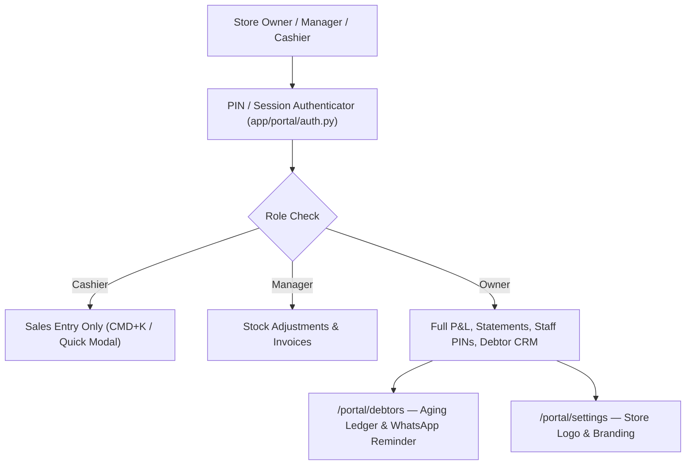

# Merchant Desktop Portal & Staff RBAC

## Goal

<!-- groundwork:auto:start goal -->
<!-- last_action: init · 2026-09-29 -->
Expand merchant desktop portal with customer debtors hub, business settings, staff cashier RBAC, and rapid CMD+K entry modal
<!-- groundwork:auto:end goal -->

## Context

Physical retail merchants in Nigeria frequently employ shop attendants and cashiers. To scale merchant adoption, TaLi must support multi-staff access with PIN-protected roles (Cashier vs Manager vs Owner), a dedicated debtor management hub ('Who Dey Owe Me'), store branding settings, and a desktop quick-entry bar.

## Architecture

### Shared State Contract

| Field | Type | Writer | Readers | Description |
|---|---|---|---|---|
| `event_id` | `str` | Channel Webhook / API / MCP | Ledger / Database | Unique idempotency reference |
| `merchant_id` | `UUID` | Auth / Channel Resolver | Handlers | Authenticated tenant context |
| `operator_id` | `str` | Admin Auth / MCP Client | Audit Trail | Originating operator identity |

## Phases & Work Packages

### Phase 1 — Core Implementation & Multi-Channel Delivery
- **WP-01**: Staff Role Model & PIN-Based Authentication — Define merchant_staff table with owner, manager, cashier roles, permissions bitmask, and 4-digit PIN authentication.
- **WP-02**: Debtor Management Hub & Aging Analysis UI — Build desktop debtors view with aging buckets (0-30d, 31-60d, 60+d), partial settlement modal, and Paystack link generator.
- **WP-03**: Merchant Business Settings & Receipt Customizer — Allow store owners to upload business logo, customize receipt header/footer, set alert thresholds, and manage staff PINs.
- **WP-04**: Desktop Quick-Action Command Bar & Modal (CMD+K) — Implement global keyboard shortcut (CMD+K / CTRL+K) opening rapid transaction entry modal with product autocomplete.
- **WP-05**: Merchant Desktop & Staff RBAC Test Suite — Add comprehensive tests proving cashiers cannot view statements or edit staff, and PIN auth security.

## UI & Visual Design Constraints

When implementing screens, cards, modals, or views:
- **Mandatory Skills**: `impeccable` and `huashu-design` MUST be used for UI layout, styling, and prototype reviews.
- **Prohibited**:
  - Emojis are strictly prohibited in all UI copy, buttons, headers, cards, and tooltips. Use clean SVG icons (Lucide / Heroicons) instead.
  - Em dashes (`—`) are strictly prohibited in all UI text and labels. Use clean hyphens (`-`) or colons (`:`).
- **Visual Assets**: Real screenshots/photos, vector illustrations (such as unDraw at `undraw.co`), and AI-generated images are permitted.

## Critical Files

- `app/data/models.py`
- `app/portal/debtors.py`
- `app/portal/settings.py`
- `app/templates/portal/layout.html`
- `tests/test_portal_staff_rbac.py`
