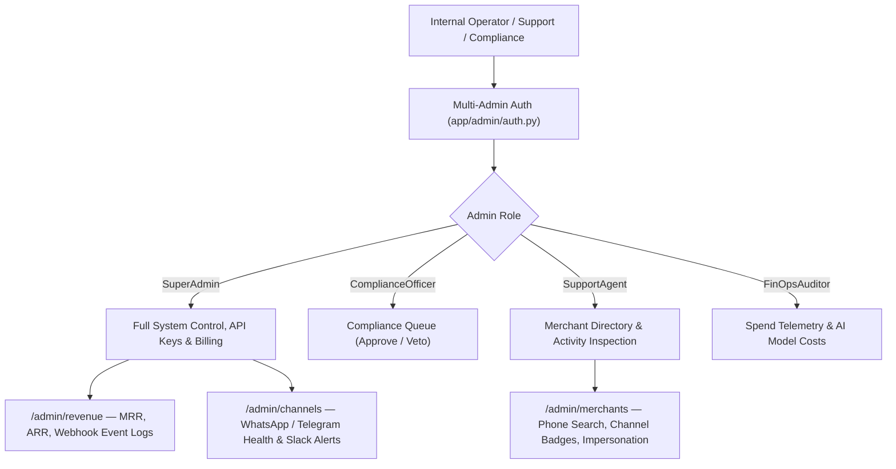

# Platform Admin Operations, Merchant CRM & Admin RBAC

## Goal

<!-- groundwork:auto:start goal -->
<!-- last_action: init · 2026-09-29 -->
Upgrade stakeholder admin portal with multi-operator RBAC, searchable Merchant CRM, Platform Revenue analytics, and channel telemetry
<!-- groundwork:auto:end goal -->

## Context

As TaLi scales toward commercial launch, platform operations require enterprise governance: multi-admin accounts with segregated duties (SuperAdmin, ComplianceOfficer, SupportAgent, FinOpsAuditor), customer CRM inspection, real-time revenue analytics, and automated ops alerting on Telegram/Slack.

## Architecture

### Shared State Contract

| Field | Type | Writer | Readers | Description |
|---|---|---|---|---|
| `event_id` | `str` | Channel Webhook / API / MCP | Ledger / Database | Unique idempotency reference |
| `merchant_id` | `UUID` | Auth / Channel Resolver | Handlers | Authenticated tenant context |
| `operator_id` | `str` | Admin Auth / MCP Client | Audit Trail | Originating operator identity |

## Phases & Work Packages

### Phase 1 — Core Implementation & Multi-Channel Delivery
- **WP-01**: Multi-Admin RBAC & Operator Session Security — Create AdminUser model supporting SuperAdmin, ComplianceOfficer, SupportAgent, and FinOpsAuditor roles.
- **WP-02**: Merchant CRM Directory & Account Detail View — Build searchable merchant CRM with phone lookup, channel binding status (WhatsApp/Telegram), and activity logs.
- **WP-03**: Platform Revenue, MRR & Paystack Webhook Log — Implement revenue analytics dashboard tracking MRR, ARR, tier breakdown, and raw Paystack webhook event stream.
- **WP-04**: Channel Health Telemetry & Operations Alerting — Build real-time WhatsApp Cloud API and Telegram Bot health dashboard with automated Slack/Telegram alerts.
- **WP-05**: Admin Action Audit Trail & Governance Test Suite — Add tests validating NDPR-compliant admin audit logging, role segregation, and unauthorized access rejections.

## UI & Visual Design Constraints

When implementing screens, cards, modals, or views:
- **Mandatory Skills**: `impeccable` and `huashu-design` MUST be used for UI layout, styling, and prototype reviews.
- **Prohibited**:
  - Emojis are strictly prohibited in all UI copy, buttons, headers, cards, and tooltips. Use clean SVG icons (Lucide / Heroicons) instead.
  - Em dashes (`—`) are strictly prohibited in all UI text and labels. Use clean hyphens (`-`) or colons (`:`).
- **Visual Assets**: Real screenshots/photos, vector illustrations (such as unDraw at `undraw.co`), and AI-generated images are permitted.

## Critical Files

- `app/data/models.py`
- `app/admin/merchants.py`
- `app/admin/revenue.py`
- `app/admin/channels.py`
- `tests/test_admin_crm_rbac.py`
