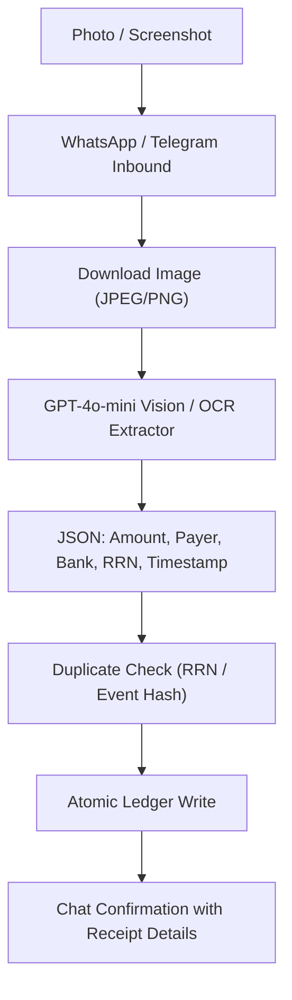

# POS & Transfer Receipt Vision Scanner (Snap & Log)

## Goal

<!-- groundwork:auto:start goal -->
<!-- last_action: init · 2026-09-29 -->
Extract and verify financial ledger transactions from photos of POS receipts and bank transfer screenshots using Vision AI
<!-- groundwork:auto:end goal -->

## Context

Over 80% of retail transactions in Nigerian retail occur via POS terminals (Moniepoint, OPay, Baxi, PalmPay) or instant mobile bank transfers. Merchants frequently take photos of paper slips or screenshot mobile banking screens. Providing a 'snap and forget' experience automates bookkeeping instantly.

## Architecture

### Shared State Contract

| Field | Type | Writer | Readers | Description |
|---|---|---|---|---|
| `event_id` | `str` | Channel Webhook | Ledger / Database | Unique idempotency reference |
| `merchant_id` | `UUID` | Auth / Channel Resolver | Handlers | Authenticated tenant context |
| `channel_type` | `str` | Webhook Router | Dispatchers | 'whatsapp' or 'telegram' |

## Phases & Work Packages

### Phase 1 — Core Implementation & Multi-Channel Delivery
- **WP-01**: Multi-Channel Image Media Download Adapter — Implement image extraction and temporary buffer handling for WhatsApp and Telegram photo attachments.
- **WP-02**: POS & Bank Screenshot Vision Prompting Engine — Build `app/services/vision_ocr.py` using GPT-4o-mini Vision with structured Pydantic extraction schema.
- **WP-03**: RRN & Transaction Reference Idempotency Check — Enforce deduplication against existing transactions and event logs using extracted reference numbers.
- **WP-04**: Vision-to-Ledger Multi-Agent Integration — Route extracted transaction models directly to `LedgerAgent` with validation and error fallbacks.
- **WP-05**: Comprehensive Vision Test Suite — Add unit tests with mock image inputs and synthetic POS/bank receipts validating parser extraction.

## Critical Files

- `app/channels/telegram.py`
- `app/web/`
- `app/data/models.py`
- `app/portal/`
- `tests/`
