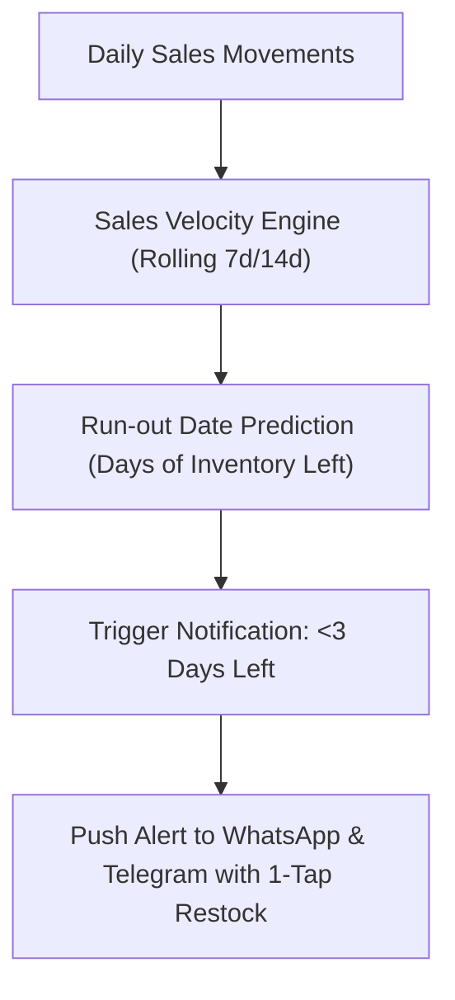

# Predictive Inventory & Smart Restock Alerts

## Goal

<!-- groundwork:auto:start goal -->
<!-- last_action: init · 2026-09-29 -->
Calculate sales velocity and trigger proactive low-stock and supplier reorder alerts on WhatsApp and Telegram
<!-- groundwork:auto:end goal -->

## Context

Running out of fast-selling stock directly loses sales to competitors. Small retailers lack sophisticated ERP tools and only notice shortages after shelves are empty. Calculating daily sales velocity and forecasting stockout dates allows proactive restocking before items deplete.

## Architecture

### Shared State Contract

| Field | Type | Writer | Readers | Description |
|---|---|---|---|---|
| `event_id` | `str` | Channel Webhook | Ledger / Database | Unique idempotency reference |
| `merchant_id` | `UUID` | Auth / Channel Resolver | Handlers | Authenticated tenant context |
| `channel_type` | `str` | Webhook Router | Dispatchers | 'whatsapp' or 'telegram' |

## Phases & Work Packages

### Phase 1 — Core Implementation & Multi-Channel Delivery
- **WP-01**: Sales Velocity & Run-out Estimation Engine — Implement `app/services/inventory_forecast.py` calculating daily burn rates and projected depletion dates.
- **WP-02**: Automated Daily Low-Stock Scan Service — Build scheduled evaluation service checking stock levels against safety stock thresholds.
- **WP-03**: Telegram & WhatsApp Proactive Restock Alerts — Implement multi-channel restock alerts with quick action buttons to adjust stock or reorder.
- **WP-04**: Supplier Reorder Message Generator — Generate pre-composed supplier WhatsApp reorder text with product quantity and previous unit price.
- **WP-05**: Inventory Forecasting Test Coverage — Add unit and integration tests covering burn-rate math, alert thresholds, and multi-channel notification triggers.

## Critical Files

- `app/channels/telegram.py`
- `app/web/`
- `app/data/models.py`
- `app/portal/`
- `tests/`
