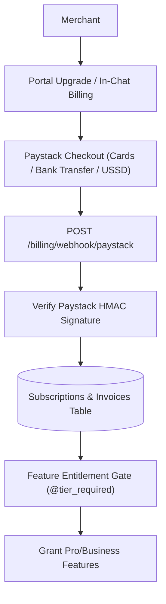

# Subscription & Billing Engine (Paystack Launch Engine)

## Goal

<!-- groundwork:auto:start goal -->
<!-- last_action: init · 2026-09-29 -->
Build merchant subscription tiers, Paystack payment webhooks, billing portal, and feature entitlement gating for commercial launch
<!-- groundwork:auto:end goal -->

## Context

To transition TaLi from a free beta into a sustainable business, we need a robust monetization engine. Implementing subscription plans (Starter Free, Merchant Pro ₦3,500/mo, Business ₦9,500/mo) powered by Paystack recurring billing, trial periods, and feature gating prepares TaLi for commercial launch.

## Architecture

### Shared State Contract

| Field | Type | Writer | Readers | Description |
|---|---|---|---|---|
| `event_id` | `str` | Channel Webhook | Ledger / Database | Unique idempotency reference |
| `merchant_id` | `UUID` | Auth / Channel Resolver | Handlers | Authenticated tenant context |
| `channel_type` | `str` | Webhook Router | Dispatchers | 'whatsapp' or 'telegram' |

## Phases & Work Packages

### Phase 1 — Core Implementation & Multi-Channel Delivery
- **WP-01**: Subscription & Billing Data Models — Define `subscriptions`, `plans`, and `billing_invoices` in `app/data/models.py` with Alembic migration.
- **WP-02**: Paystack Webhook & Verification Engine — Build `app/web/billing_routes.py` with HMAC signature verification and recurring event lifecycle handlers.
- **WP-03**: Merchant Portal Billing & Upgrade Hub — Create subscription management UI in merchant portal showing current plan, renewal date, and invoices.
- **WP-04**: Feature Entitlement & Tier Gating Middleware — Implement `@tier_required` decorator gating premium features (Voice Notes, Vision, Credit Dossier).
- **WP-05**: Billing Lifecycle & Webhook Test Suite — Add unit and integration tests covering subscription creation, renewals, failed charges, and cancellation.

## UI & Visual Design Constraints

When implementing WP-03 (Merchant Portal Billing & Upgrade Hub) and related screens:
- **Mandatory Skills**: `impeccable` and `huashu-design` MUST be used for UI layout, styling, and prototype reviews.
- **Prohibited**:
  - Emojis are strictly prohibited in all UI copy, buttons, headers, cards, and tooltips. Use clean SVG icons (Lucide / Heroicons) instead.
  - Em dashes (`—`) are strictly prohibited in all UI text and labels. Use clean hyphens (`-`) or colons (`:`).
- **Visual Assets**: Real screenshots/photos, vector illustrations (such as unDraw at `undraw.co`), and AI-generated images are permitted.

## Critical Files

- `app/channels/telegram.py`
- `app/web/billing_routes.py`
- `app/data/models.py`
- `app/portal/`
- `tests/test_paystack_webhook.py`
