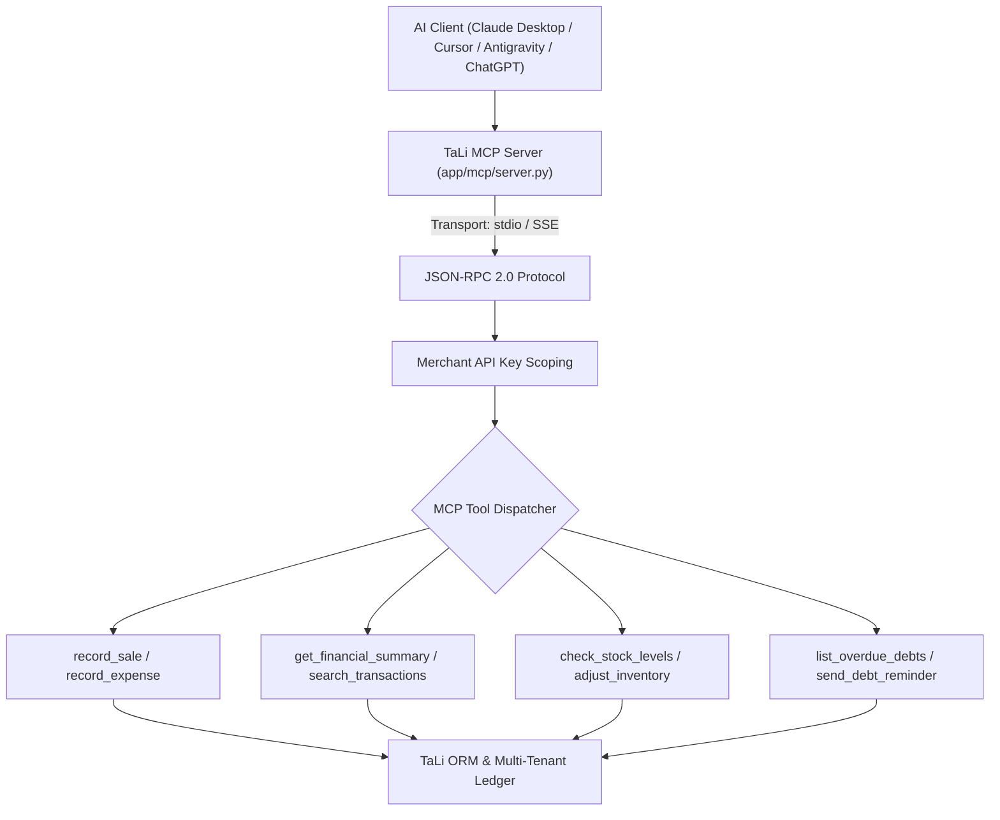

# TaLi Model Context Protocol (MCP) Server

## Goal

<!-- groundwork:auto:start goal -->
<!-- last_action: init · 2026-09-29 -->
Implement TaLi MCP Server enabling Claude, Cursor, Antigravity, and ChatGPT to interact directly with merchant books
<!-- groundwork:auto:end goal -->

## Context

The Model Context Protocol (MCP) enables external AI assistants to use TaLi as a specialized bookkeeping tool. Store owners, accountants, and developers can connect their desktop AI clients to query sales, record transactions, verify inventory, and trigger debt reminders using natural language.

## Architecture

### Shared State Contract

| Field | Type | Writer | Readers | Description |
|---|---|---|---|---|
| `event_id` | `str` | Channel Webhook / API / MCP | Ledger / Database | Unique idempotency reference |
| `merchant_id` | `UUID` | Auth / Channel Resolver | Handlers | Authenticated tenant context |
| `operator_id` | `str` | Admin Auth / MCP Client | Audit Trail | Originating operator identity |

## Phases & Work Packages

### Phase 1 — Core Implementation & Multi-Channel Delivery
- **WP-01**: Model Context Protocol Server Architecture & Transport — Build Python-based MCP server with stdio transport and SSE HTTP transport (/mcp/sse) using standard MCP specification.
- **WP-02**: Merchant Ledger & Cashflow Tools — Implement MCP tools: record_sale, record_expense, get_financial_summary, search_transactions.
- **WP-03**: Stock & Inventory Management Tools — Implement MCP tools: check_stock_levels, get_low_stock_alerts, adjust_inventory.
- **WP-04**: Debtor Management & Statement Tools — Implement MCP tools: list_debtors, send_debt_reminder, generate_statement_summary.
- **WP-05**: TaLi MCP Server Security, Auth & Verification Test Suite — Add tests validating tool call authorization, tenant isolation (cannot query other merchants), and JSON-RPC compliance.

## UI & Visual Design Constraints

When implementing screens, cards, modals, or views:
- **Mandatory Skills**: `impeccable` and `huashu-design` MUST be used for UI layout, styling, and prototype reviews.
- **Prohibited**:
  - Emojis are strictly prohibited in all UI copy, buttons, headers, cards, and tooltips. Use clean SVG icons (Lucide / Heroicons) instead.
  - Em dashes (`—`) are strictly prohibited in all UI text and labels. Use clean hyphens (`-`) or colons (`:`).
- **Visual Assets**: Real screenshots/photos, vector illustrations (such as unDraw at `undraw.co`), and AI-generated images are permitted.

## Critical Files

- `app/mcp/server.py`
- `app/mcp/tools_ledger.py`
- `app/mcp/tools_inventory.py`
- `app/mcp/tools_reports.py`
- `tests/test_tali_mcp.py`
