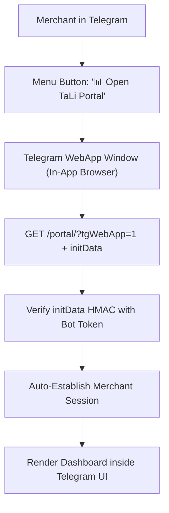

# Telegram Mini App (Embedded WebApp Portal)

## Goal

<!-- groundwork:auto:start goal -->
<!-- last_action: init · 2026-09-29 -->
Embed the merchant self-service web portal directly inside Telegram as a native Telegram WebApp with single sign-on
<!-- groundwork:auto:end goal -->

## Context

Switching from chat to an external mobile browser and logging in via OTP introduces friction. Telegram Mini Apps (WebApps) allow embedding the existing Flask Merchant Portal directly inside Telegram with cryptographic single sign-on (`initData`), delivering a frictionless, native app-like experience.

## Architecture

### Shared State Contract

| Field | Type | Writer | Readers | Description |
|---|---|---|---|---|
| `event_id` | `str` | Channel Webhook | Ledger / Database | Unique idempotency reference |
| `merchant_id` | `UUID` | Auth / Channel Resolver | Handlers | Authenticated tenant context |
| `channel_type` | `str` | Webhook Router | Dispatchers | 'whatsapp' or 'telegram' |

## Phases & Work Packages

### Phase 1 — Core Implementation & Multi-Channel Delivery
- **WP-01**: Telegram initData HMAC Verification Authenticator — Implement cryptographic validator in `app/portal/auth.py` verifying Telegram WebApp credentials.
- **WP-02**: Seamless Portal Auto-Login Middleware — Add route handler and session bridge in `app/portal/routes.py` authenticating merchants via WebApp headers.
- **WP-03**: Telegram Bot Menu Button & Deep Link Integration — Configure Telegram bot menu button and inline `/portal` command launching the in-app WebApp.
- **WP-04**: Responsive Viewport & Telegram Theme Adaptation — Inject Telegram WebApp JS SDK into `app/templates/portal/layout.html` and optimize mobile touch navigation.
- **WP-05**: Mini App Authentication & Portal Test Suite — Add unit tests validating HMAC signature verification, session creation, and replay attack prevention.

## UI & Visual Design Constraints

When implementing Mini App layouts (WP-04) and portal touch viewports:
- **Mandatory Skills**: `impeccable` and `huashu-design` MUST be used for Telegram theme integration, mobile touch states, and layout polish.
- **Prohibited**:
  - Emojis are strictly prohibited in all UI copy, buttons, headers, cards, and bottom tabs. Use clean SVG icons (Lucide / Heroicons) instead.
  - Em dashes (`—`) are strictly prohibited in all UI text and labels. Use clean hyphens (`-`) or colons (`:`).
- **Visual Assets**: Real photos, vector illustrations (such as unDraw at `undraw.co`), and AI-generated images are permitted.

## Critical Files

- `app/channels/telegram.py`
- `app/portal/`
- `app/templates/portal/`
- `tests/test_telegram_channel.py`
