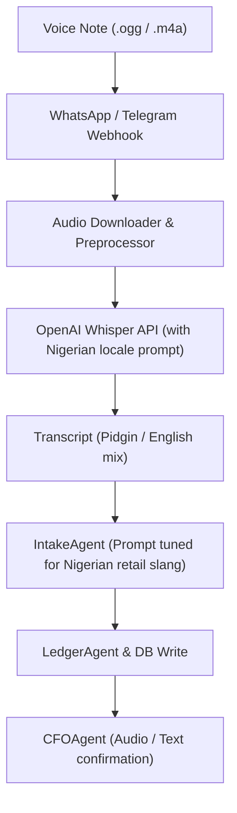

# Voice Notes Ledger (Pidgin & Local Languages via Whisper)

## Goal

<!-- groundwork:auto:start goal -->
<!-- last_action: init · 2026-09-29 -->
Ingest and process WhatsApp and Telegram voice notes in Nigerian Pidgin and local languages via Whisper and multi-agent intent mapping
<!-- groundwork:auto:end goal -->

## Context

Informal merchants in open markets (Balogun, Alaba, Trade Fair) rarely type out ledger transactions while attending to customers. Instead, they rely on voice notes. Capturing spontaneous voice messages in Nigerian Pidgin, Yoruba, Igbo, and Hausa removes 90% of data-entry friction and allows hands-free transaction logging.

## Architecture

### Shared State Contract

| Field | Type | Writer | Readers | Description |
|---|---|---|---|---|
| `event_id` | `str` | Channel Webhook | Ledger / Database | Unique idempotency reference |
| `merchant_id` | `UUID` | Auth / Channel Resolver | Handlers | Authenticated tenant context |
| `channel_type` | `str` | Webhook Router | Dispatchers | 'whatsapp' or 'telegram' |

## Phases & Work Packages

### Phase 1 — Core Implementation & Multi-Channel Delivery
- **WP-01**: Multi-Channel Audio Ingestion & Media Retrieval — Add voice message event handlers in WhatsApp and Telegram webhooks to securely download audio clips to temporary storage.
- **WP-02**: Whisper Audio Transcription Service — Implement `app/services/speech.py` calling Whisper API with Nigerian retail domain prompts and format conversion.
- **WP-03**: Pidgin & Local Slang Normalization Layer — Extend `app/services/nlp.py` with glossary mapping for local currency slang ('k', 'carton', 'bag', 'naira').
- **WP-04**: Conversational Audio Confirmation Pipeline — Wire transcribed text into IntakeAgent pipeline and return localized confirmation responses in chat.
- **WP-05**: Voice Pipeline Integration & Mock Test Suite — Add unit and integration tests mocking audio downloads and Whisper responses without network dependencies.

## Critical Files

- `app/channels/telegram.py`
- `app/web/`
- `app/data/models.py`
- `app/portal/`
- `tests/`
